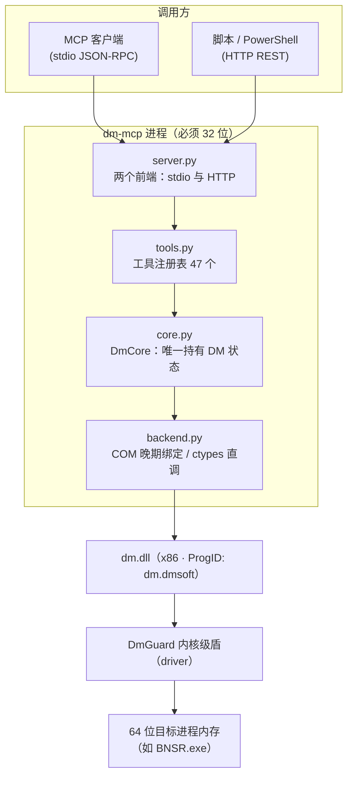
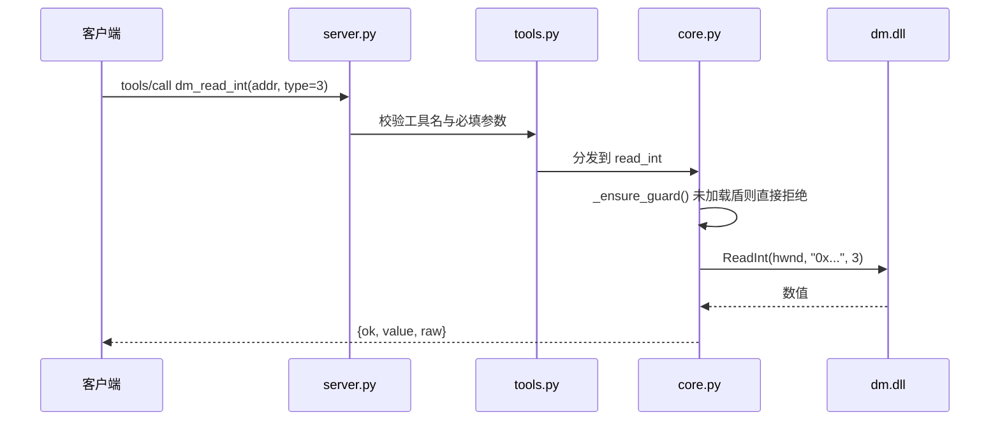

<div align="center">

# dm-mcp：大漠插件（DM）MCP 服务

**把大漠插件（DM）的内存读写能力封装为 MCP / REST 服务，内置 47 个工具，供上层稳定读写目标进程内存**

[](https://www.python.org/)


[](LICENSE)

</div>

---

常驻进程形态的大漠插件服务，**以内存读写为核心能力**，覆盖 DM 的内存读写、内存搜索、目标进程内存操作，以及必要的窗口/进程/输入辅助接口，并以 **MCP（stdio / HTTP JSON-RPC）** 与 **本地 REST 桥** 两种方式对外提供。

## 目录

- [硬性约束](#硬性约束本服务的设计前提)
- [架构与调用链](#架构与调用链)
- [一、目录结构](#1-目录结构)
- [二、快速开始](#2-快速开始)
- [三、最小调用序列](#3-最小调用序列)
- [四、能力总览](#4-能力总览)
- [五、安全与风险说明](#5-安全与风险说明)
- [六、验证状态](#6-验证状态重要务必阅读)
- [七、许可证](#7-许可证)
- [八、免责声明](#8-免责声明)
- [九、交流与反馈](#9-交流与反馈)

## 硬性约束（本服务的设计前提）

本服务能被搭起来，前提条件是下面三条。它们不是"最佳实践建议"，而是**不满足就一定跑不通**的硬约束。

1. 宿主进程必须是 **32 位**：`dm.dll` 为 x86 组件；DM 通过内核级 `DmGuard` 盾访问 64 位目标进程（如 `BNSR.exe`），因此 32 位宿主 + 盾是读写 64 位目标的唯一可行组合。
   - **启动自检（默认行为）**：`run_server.py` 启动时先检测自身位数；若当前是 64 位，会自动查找本机 32 位 Python 并**用其重新拉起自身**（stdio 管道继承，MCP 客户端无感）；找不到则打印“获取 / 配置 32 位 Python”的引导文案并以返回码 2 退出，不会静默降级。
   - 指定 32 位解释器的三种方式（优先级由高到低）：`--python32 "D:\Python311-32\python.exe"` → `config.json` 的 `python32_path` → 环境变量 `DM_MCP_PYTHON32`；也可把 32 位解释器放到项目 `python32\python.exe`。
2. **必须先加载 dm 盾**：`dm_load` → `dm_guard`（默认 `memory2` + `b3`）。未加载盾时，所有内存读/写/搜索/内存操作接口一律返回 `DM_GUARD_NOT_LOADED` 并拒绝执行。
3. 实测约定（沿用既有工程结论，并已在本机 DM 7.2607 上复验）：读 64 位指针必须 `type=3`；窗口绑定后**不要**置 `SetMemoryHwndAsProcessId(1)`（置 1 会让内存函数把 hwnd 当 PID，读取全失败）；DM 地址为 CE 风格字符串。
   - 至于 `SetAsmHwndAsProcessId(1)`：既有结论建议调用，但本机 DM 7.2607 的 COM 后端**并没有这个接口**（调用返回 `DM_NOT_SUPPORTED`）。因此本服务把它作为**可选调优**处理——调不通只记 `optional_failed`，不影响绑定与读写，`dm_bind_window` 的返回体会给出说明。

**窗口绑定有两条路径**，服务启动时都会自动执行一次：

| 路径 | 触发条件 | 行为 |
|---|---|---|
| 参数化绑定（推荐） | 启动时传 `--hwnd` / `config.json` 的 `hwnd` | **严格绑定该句柄**，完全不做窗口查找与类名/标题复核；`source` 记为 `explicit-hwnd` |
| 自动查找 | 未传 `hwnd` | 按 `class=UnrealWindow` + 标题含“剑灵” + 进程 `bnsr.exe` 查找；命中后**复核**类名与标题，避免误绑到第三方同名窗口，结果写入 `dm_status.auto_bind` |

关闭自动查找：`--no-autobind` 或 `config.json` 的 `"auto_bind": false`。游戏后启动或窗口重建时，再调一次 `dm_auto_bind` 或 `dm_bind_hwnd` 即可。


---

## 架构与调用链

本机既有的几个逆向 MCP（`x64dbg-mcp-server` 的"插件 REST 桥 + 独立 MCP 适配层"、`CE_MCP_Bridge`）都采用两层结构。dm-mcp 沿用同一分层思路，但把两层**合并进同一个进程**，省掉跨进程通信这一层脆弱环节。



一次内存读取要穿过四层，每层职责单一，出问题时能快速定位到是哪一层：



两个设计取舍值得单独说明。

**第一，地址一律以 CE 风格字符串下发，不做数值转换。** DM 的 `addr` 参数接受 `0x140000000`、`bnsr+0x1234567`、`[0x1234]+8` 这类表达式，由 DM 自己解析。早期版本曾把地址转成十进制字符串再传，结果是 DM **静默返回 0**——没有任何报错，所有读写都返回 0，属于最难排查的一类缺陷。现在 `addr` 统一为字符串直传。

**第二，HTTP 模式刻意使用单线程 `HTTPServer`。** DM 是 STA 组件，跨公寓调用会失败。用 `ThreadingHTTPServer` 虽然并发更好看，但 `CoInitializeEx` 与后续调用会落到不同线程与公寓上。所以这里放弃并发，换取"加载一次、长期服务"的确定性。

---

## 1. 目录结构

```
<项目根>\
├── run_server.py            统一入口（stdio / http / --check 自检）
├── setup_once.py            一次性凭据与权限配置（注册码+附加码+管理员快捷方式）★推荐先用
├── selftest.py              自检脚本（加载→盾→绑定→真实读/写；入口强制 --check）
├── config.example.json      配置示例（复制为 config.json）
├── dm_reg.txt               凭据文件（已 gitignore；由 setup_once.py 生成）
├── 启动_HTTP常驻.bat        常驻模式一键启动（ASCII 内容，避免中文编码问题）
├── 自检.bat                 一键自检
├── tests_addr_format.py     地址格式回归测试（离线，41 项）
├── tests_regression_unregistered.py  未注册安全性回归（离线，4 项）
├── tests_http_regression.py HTTP 端到端回归（区分已注册/未注册两种模式）
├── dm_mcp\
│   ├── backend.py           DM 宿主后端：ctypes 直调 dm.dll 导出 / COM IDispatch 晚期绑定
│   ├── core.py              DM 能力核心：生命周期、盾、绑定、读写、搜索、内存操作
│   ├── tools.py             工具注册表（MCP tools/list 与 tools/call 的唯一事实来源）
│   ├── server.py            MCP stdio 前端 + HTTP(JSON-RPC / REST) 前端
│   ├── hostenv.py           32 位宿主自举（探测/校验 32 位解释器、64 位自动重拉、引导文案）
│   └── errors.py            服务层错误码与异常
└── docs\
    ├── 01-架构设计.md
    ├── 02-工具参考与错误码.md
    ├── 03-使用示例.md
    ├── 04-常见问题.md
    ├── 05-工程化完善记录_v1.1.md   ← 代码质量整改记录（含每项问题/修改/验证）
    ├── 06-实机验证记录_v1.1.1.md   ← 真机验证发现的缺陷与修复
    └── 07-实机验证记录_v1.1.2.md   ← 真实凭据下打通读写链路；含 ACE 搜索限制的完整定位
```

> 现状版本：`1.1.3`。1.1.1 是**未注册安全性**修复（未注册时 `DmGuard`/`BindWindow` 会硬崩，现已阻止；
> `GetClassName` 兼容本机 DM 的 `GetWindowClass` 命名）。
> **1.1.2 是"让读写真正能用"的修复**——用真实凭据实测后定位到 4 个 P0/P1 缺陷：
>
> | 编号 | 问题 | 影响 |
> |---|---|---|
> | D5 | 地址传给 DM 时用了**十进制字符串**，DM **静默返回 0** | 所有读写返回 0（最危险，无任何报错） |
> | D6 | `VirtualAllocEx/FreeEx` 按 Win32 直觉传参，**COM 参数个数不匹配** | 内存申请/释放必失败 |
> | D7 | `FindInt` 等把 `step` 传到了 `value_max` 位置 | 搜索除 0/1 外一律搜不到 |
> | D8 | `Reg` 硬编码第 2 参 `""`，附加码传不进去 | 凭据配置不实 |
>
> 另修复 D9（`HTTPServer.getfqdn` 在 Python 3.11.0b5 上抛 idna 异常）。
> **重要外部限制**：剑灵 ACE 保护下 `Find*` 全系列搜索不可用（读写正常），
> 这是 ACE 的影子页防护、**非本项目缺陷**，详见
> [docs/07](docs/07-实机验证记录_v1.1.2.md) §5 与 [Q22](docs/04-常见问题.md#q22-dm_find_int--dm_find_data-一直搜不到东西)。
>
> `dm_find_*` 的 `values` 参数改名为 `value_min`/`value_max`
> （为对齐 DM 真实签名），`dm_virtual_free_ex` 去掉了 `size`/`type` 参数。
> 详见 [docs/05](docs/05-工程化完善记录_v1.1.md)、[docs/06](docs/06-实机验证记录_v1.1.1.md)、
> [docs/07](docs/07-实机验证记录_v1.1.2.md)。
>
> **1.1.3 是"窗口句柄参数化"**——`hwnd` 从"服务自己去找"改为"由调用方传入"，
> 并新增 `dm_bind_hwnd` 工具；工具总数 46 → **47**。三项改动：
>
> | 编号 | 改动 | 为什么 |
> |---|---|---|
> | C1 | 新增 `--hwnd`（及 `config.json` 的 `hwnd`），给了它就**严格绑定该句柄**，完全不做窗口查找与类名/标题复核 | 自动查找依赖"类名 == `UnrealWindow` 且标题含《剑灵》"的复核。实测本机存在第三方助手进程持有标题含"剑灵"的窗口，复核虽能拦下误绑，但"我明确知道要绑哪个句柄"时再去找一遍纯属多余 |
> | C2 | 新增工具 `dm_bind_hwnd`，回显 `source: "explicit-hwnd"` | 让"参数化绑定"成为一个可被 MCP 客户端直接调用的正式能力，而不是只藏在启动参数里 |
> | C3 | `SetAsmHwndAsProcessId` 与 `AsmSetTimeout` 降为**可选调优**，失败只记 `optional_failed` 不再报错 | dm.dll 7.2607 的 COM 后端**没有** `SetAsmHwndAsProcessId`（返回 `DM_NOT_SUPPORTED`），但它并非绑定必要条件：同轮实测该步失败后 `GetModuleBaseAddr(bnsr.exe)` 仍为 `0x140000000`、首 4 字节仍是 `0x905A4D`。此前把它当致命错误，会制造"窗口已绑好、内存也能读，但服务报告绑定失败"这种最误导人的状态 |
>
> 1.1.3 的实测结论：`dm_status` 回报
> `dm_version=7.2607`、`registered=true`、`guard_loaded=true`、`bound_hwnd=0x1102b2`、
> `auto_bind.source=explicit-hwnd`；只读链路（load → status → bind → module_base → read MZ）
> 与读写链路（申请临时内存 → 写 8 字节 → 读回一致 → 释放）全部通过。

---

## 2. 快速开始

### 2.0 一次性配置（推荐先做这一步，"一劳永逸"）

```bat
:: 只体检，不改任何文件（先看现状）
python setup_once.py --check

:: 写入凭据 + 32 位宿主路径 + 生成管理员快捷方式
python setup_once.py --apply --reg-code 你的注册码 --extra-code 你的附加码

:: 回滚
python setup_once.py --revert
```

完成后会得到「**dm-mcp HTTP 服务（管理员）.lnk**」——**双击即自动弹 UAC 提权**，
不用再记着"右键→以管理员身份运行"。凭据落在 `dm_reg.txt`（已 gitignore、读盘即生效）。

详见 [Q23 怎么设置才能"一劳永逸"](docs/04-常见问题.md#q23-怎么设置才能一劳永逸)。

### 2.1 启动与自检

```bat
:: 0) 宿主位数自检（run_server.py 启动时会自动执行；64 位时自动改用 32 位解释器重新拉起自身）
python -c "import ctypes;print(ctypes.sizeof(ctypes.c_void_p)*8)"

:: 0.1) 指定 32 位解释器（可选，三种方式任选其一）
::      命令行：--python32 "D:\Python311-32\python.exe"
::      config.json：{"python32_path": "D:\\Python311-32\\python.exe"}
::      环境变量：set DM_MCP_PYTHON32=D:\Python311-32\python.exe

:: 1) 复制配置并填写 dm.dll 路径与注册码
copy config.example.json config.json

:: 2) 自检（加载 -> 注册 -> 加载盾 -> 绑定窗口 -> 读模块基址 MZ 头）
python run_server.py --check

:: 2.1) 自检时直接指定句柄（跳过窗口查找，最稳；句柄会随 64->32 位自举一起传递）
python run_server.py --check --hwnd 0x1102B2

:: 3) 需要验证写能力时（仅写本服务申请的临时内存，不触碰游戏数据）
python run_server.py --check --allow-write

:: 4) 常驻 HTTP 服务（MCP: POST /mcp ；REST: /api/<tool>）
python run_server.py --mode http --port 27043

:: 4.1) 常驻并直接绑定指定句柄 —— **推荐用法**，不做窗口查找与类名/标题复核
python run_server.py --mode http --port 27043 --hwnd 0x1102B2

:: 5) MCP stdio 服务（由 MCP 客户端拉起，须指向 32 位 Python）
python run_server.py --mode stdio
```

> `--hwnd` 也可以写进 `config.json` 的 `"hwnd"` 字段，省得每次敲。
> 64 位宿主自举时会带上整个 `argv`，所以 `--hwnd` 在"自动改用 32 位解释器重新拉起自身"之后依然有效。

MCP 客户端（stdio）配置示例：

```json
{
  "mcpServers": {
    "dm-mcp": {
      "command": "C:\\Path\\To\\Python32\\python.exe",
      "args": ["<项目根>\\run_server.py", "--mode", "stdio", "--hwnd", "0x1102B2"]
    }
  }
}
```

> `--hwnd` 是可选但推荐的：不传则服务启动时自动查找《剑灵》窗口。

---

## 3. 最小调用序列

> 服务启动时**已自动完成**前两步（加载 dm + 加载盾 + 绑定窗口）。绑定有两条路径：
> **传了 `--hwnd`（或 `config.json` 的 `hwnd`）就严格绑定该句柄，完全不做窗口查找与复核**；
> 没传才退回"自动查找"（`class=UnrealWindow` + 标题含"剑灵" + `bnsr.exe`，命中后仍会复核）。
> 绑定结果见 `dm_status.auto_bind`，其中 `source` 会告诉你走的是哪条路径。

```
dm_status                                               -> 查看 host.bits / guard_loaded / bound_hwnd / auto_bind
dm_bind_hwnd(hwnd="0x1102B2")                           -> 严格绑定指定句柄（不查找、不复核），source=explicit-hwnd
dm_auto_bind()                                          -> 自动查找并绑定《剑灵》（class=UnrealWindow + 标题含"剑灵" + bnsr.exe）
dm_find_window(class_name="UnrealWindow", title="剑灵")   -> hwnd（手动方式，一般不需要）
dm_bind_window(hwnd="0x1102B2")                         -> 绑定（与 dm_bind_hwnd 的差别：本接口不做入参来源标记）
dm_get_module_base_addr(module_name="bnsr.exe")         -> base = 0x140000000
dm_read_int(addr="0x140000000", type=0)                 -> 0x905A4D（MZ 头）
dm_read_int(addr="0x14xxxxxx", type=3)                  -> 64 位指针/数值（HP 等）
```

`hwnd` 一律同时接受 `"0x1102B2"`（十六进制字符串）与 `1114802`（十进制）两种写法；
`dm_status` 回报的 `bound_hwnd` 本身就是 `"0x..."` 形式，可以原样复制回填给其他工具。

`dm_load` 一般不需要手动调用：服务启动时会自动加载并（默认）加载盾；如启动时加载失败，服务仍会启动，可随后在线调用 `dm_load` 重试。

---

## 4. 能力总览

| 分类 | 工具 |
|---|---|
| 生命周期/状态 | `dm_load` `dm_status` `dm_auto_bind` `dm_reg` `dm_guard` `dm_get_last_error` `dm_version` `dm_set_path` `dm_raw_call` |
| 窗口/进程 | `dm_find_window` `dm_find_window_by_process` `dm_enum_window` `dm_set_target` `dm_bind_window` `dm_bind_hwnd` `dm_unbind_window` `dm_set_asm_hwnd_as_process_id` `dm_set_memory_hwnd_as_process_id` `dm_get_process_id` `dm_get_module_base_addr` `dm_get_window_title` `dm_get_class_name` `dm_get_window_rect` |
| 内存读（需盾） | `dm_read_int` `dm_read_float` `dm_read_double` `dm_read_string` `dm_read_data` |
| 内存写（需盾） | `dm_write_int` `dm_write_float` `dm_write_double` `dm_write_string` `dm_write_data` |
| 内存搜索（需盾） | `dm_find_int` `dm_find_float` `dm_find_double` `dm_find_string` `dm_find_data` |
| 目标进程内存操作（需盾） | `dm_virtual_alloc_ex` `dm_virtual_protect_ex` `dm_virtual_free_ex` |
| 输入（辅助） | `dm_key_down` `dm_key_up` `dm_key_press` `dm_move_to` `dm_left_click` `dm_set_keypad_delay` |

共 47 个工具，参数、返回值与错误码见 [docs/02-工具参考与错误码.md](docs/02-工具参考与错误码.md)。其中 `dm_auto_bind` 是启动默认绑定的手动复用入口（游戏后启动 / 窗口重建时调用）；`dm_bind_hwnd` 是**参数化绑定**入口——你不知道、也不想让服务去猜窗口时，直接把它绑过去。

---

## 5. 安全与风险说明

- 本服务**只读为主**：读接口无副作用；写接口（`dm_write_*` / `dm_virtual_*`）会真实修改目标进程内存，属**中风险**操作，返回体带 `risk` 标注。
- 自检脚本默认**只读**；`--allow-write` 时也只是在目标进程内申请一小块临时内存做写入回读校验，不写任何游戏数据结构。
- 不提供“绕过安全验证”“批量破坏性写入”类能力；`dm_raw_call` 对 `Read*/Write*/Find*/Virtual*` 前缀接口强制校验盾状态。
- **凭据管理**：注册码不写入代码。支持三种来源，优先级从高到低：
  1. 命令行 `--reg-code "xxxx"`
  2. 环境变量 `DM_REG_CODE`（**推荐**，不落盘）
  3. `config.json` 的 `reg_code` 字段（明文落盘，仅适合本机自用）

  `config.json` 已在 `.gitignore` 中排除，请勿把它提交到仓库或分享给他人。
- **窗口绑定安全**：`dm_auto_bind` 在完成绑定前会**复核**候选窗口
  （类名必须完全等于 `window_class`，标题必须包含 `window_title`），避免误绑到
  同名窗口类/标题的其他进程。仅当显式传入 `hwnd` 时跳过复核。
- **HTTP 加固**：单次请求体上限 1 MiB（超出返回 `413 REQUEST_TOO_LARGE`）；
  未知工具返回 `400`；业务级错误返回 `200` + 结构化错误体（便于脚本客户端直接读取）。
  可选 `token` 校验（请求头 `X-DM-Token` 或 URL 参数 `token`）。

---

## 6. 验证状态（重要，务必阅读）

**已在真实环境实测通过**：32 位 Python 3.11.0b5 宿主 + 真实注册码 + 运行中的《剑灵》客户端，
`dm_version=7.2607`。只读链路（加载 → 注册 → 加载盾 → 绑定 → 取模块基址 → 读 MZ 头）
与读写链路（申请临时内存 → 写 8 字节 → 读回一致 → 释放）全部通过；
HTTP 端到端回归（47 个工具、绑定路径、错误码、真读校验）亦全部通过。

需要注意，**自检与回归都依赖具体环境**（32 位宿主、dm.dll 路径、注册码、目标进程是否存在），
换一台机器必须重跑一遍才能得出该机结论。自检输出逐项如下：

```
[1] 加载 dm.dll / 创建 dm.dmsoft 并加载盾        OK
[2] 读取状态（盾状态必须为 true）                 OK
[3] 查找目标窗口（class=UnrealWindow, 标题含 剑灵）OK   hwnd=0x1102B2
    （传了 --hwnd 时本步会打印"[跳过] 未做窗口查找"，直接采用传入句柄）
[4] 绑定窗口 + SetAsmHwndAsProcessId             OK   已绑定 0x1102B2
    （若本机 DM 无 SetAsmHwndAsProcessId，会记入 optional_failed 并说明"不影响内存读写"）
[5] 取模块基址（GetModuleBaseAddr bnsr.exe）      OK   0x140000000
[6] 真实读内存：读模块基址首 4 字节（MZ=0x905A4D） OK
[7] 真实写内存（仅 --allow-write）                 OK   读回一致，free_ret=1
```

如任一步失败，脚本会打印服务层错误码、DM 返回值与 `GetLastError`，可直接对照 [错误码文档](docs/02-工具参考与错误码.md) 定位。

`selftest.py` 与 `run_server.py --check` 是同一套检查：前者是便捷入口（内部强制补 `--check` 后再委托主入口，避免退化成"启动服务"）。

---

## 7. 许可证

本项目以 [GNU General Public License v3.0](LICENSE) 发布。

> 本项目依赖的第三方组件（大漠插件 `dm.dll`、其内核级 `DmGuard` 盾驱动等）版权归各自作者所有，
> **不随本仓库分发**，请自行获取并遵守各自的许可协议与授权要求。

---

## 8. 免责声明

- 本服务仅供**学习与技术研究**使用，请勿用于任何违反法律法规或第三方服务条款的场景。
- 本服务只提供中立的**进程内存读写能力**，不针对任何特定软件；用它做什么由调用方自行决定。
- 使用者需自行承担因使用本服务产生的一切后果，包括但不限于目标软件服务条款风险与账号风险。
- 请勿将本服务用于未授权的内存修改或自动化操作；因滥用造成的任何损失，作者不承担责任。

---

## 9. 交流与反馈

<div align="center">

<p><strong>踩到坑了？想聊聊实现细节？欢迎加群 —— 版本更新与问题答疑第一时间同步</strong></p>

<p>
<a href="https://qm.qq.com/q/89nIPLRrCU" title="易语言+AI-吹牛逼（群号 607124662）"></a>
&nbsp;&nbsp;
<a href="https://qm.qq.com/q/Fv9KjpGCEq" title="易语言 jadeView 前端UI（群号 1103426302）"></a>
</p>

<p>
<strong>易语言+AI-吹牛逼</strong> ｜ 群号 <code>607124662</code><br>
<strong>易语言 jadeView 前端UI</strong> ｜ 群号 <code>1103426302</code>
</p>

<p><sub>点击上方按钮即可一键加群，无需手动搜索群号</sub></p>

</div>
